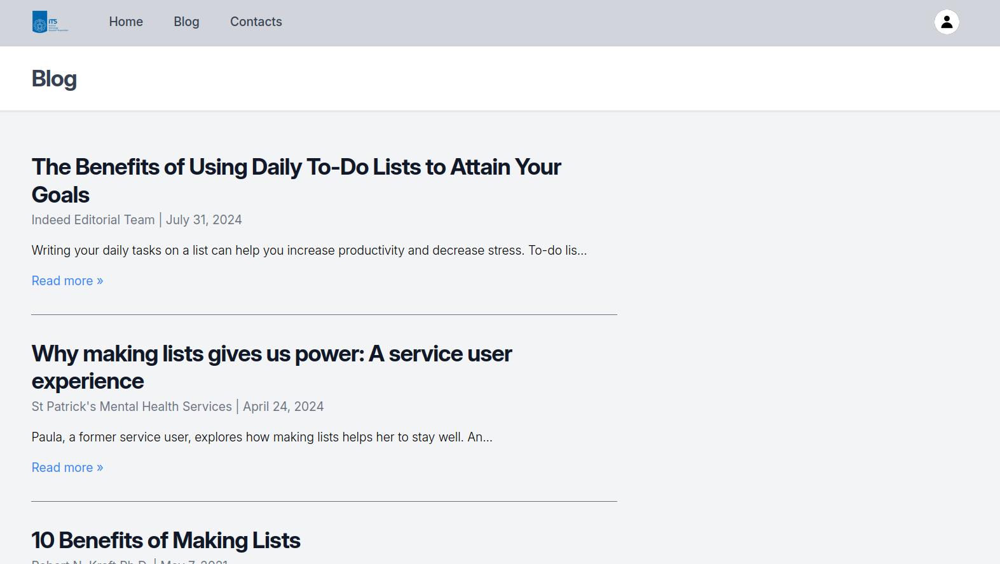

### Update Course 6 : N+1, Redesign UI, Searching, Pagination ###
Reduce the number of queries by making advance requests. Imported a package to visualize the number of queries.

I used a new template from tailwind for my blog page and my post page.

New interface for blog page

New interface for post page

Add the possibility to search article by writting a word from the title
New interface for blo page

Devide the blog page with pagination (9 articles per page)

### Update Course 5 : use Factory + Eloquent Relationship + Seeder ###
Now I can generate random articles in my blog (title, date, author, slug and text are random)
Still 1 problem : text doesn't generate in english but I don't try how to fix it

The article and the author are now linked => the article is created by an author from the users database.
When you click on the author of an article, there is a new page with all the articles from this author.

The articles are generating related to a category. Each article is linked to a category.
When you click on a category, a new page has been created to diaply all the articles from this category.

Seeders have been created to more easily generate data. One seeder for autors, one for category and one for posts. 

Other pages didn't change

### Update Course 4 : use Database ###
Nothing has change in the visuals of the application but the structure has been changed.

Now the data from the articles and from the homepage list are not in the models anymore but they have been added to the database.
A MySQL databse is used but we add data manually in it (for now).

### Update Course 3 : add Models ###
## Home page 

The user interface from the homepage is the same but it has changed in the code : I defined a model to store my list of elements.

### Blog page ###

I added a new page : the blog page.
I defined a model where I add articles that I found on the web which explain why it is usefull and good to make lists.

### Contacts page ###

It remains the same as before, didn't change

# First commit + Add component #
### Header of the application ###
I defined the header of the application in a component to display it on every page.
When you click on the ITS logo you are redirected to the ITS website.

### Home page ###

This is the first version of my application's homepage. 
I imagine that my application will be used to manage to-do tasks.
For now you can only check a task already writting.

### Contacts page ###

I created this page to imagine that the user can contact a support for any question.
I have found a template to fill in a form that I have adapted to my needs.
I defined this template in a component and added it to my page.

## About Laravel

Laravel is a web application framework with expressive, elegant syntax. We believe development must be an enjoyable and creative experience to be truly fulfilling. Laravel takes the pain out of development by easing common tasks used in many web projects, such as:

- [Simple, fast routing engine](https://laravel.com/docs/routing).
- [Powerful dependency injection container](https://laravel.com/docs/container).
- Multiple back-ends for [session](https://laravel.com/docs/session) and [cache](https://laravel.com/docs/cache) storage.
- Expressive, intuitive [database ORM](https://laravel.com/docs/eloquent).
- Database agnostic [schema migrations](https://laravel.com/docs/migrations).
- [Robust background job processing](https://laravel.com/docs/queues).
- [Real-time event broadcasting](https://laravel.com/docs/broadcasting).

Laravel is accessible, powerful, and provides tools required for large, robust applications.

## Learning Laravel

Laravel has the most extensive and thorough [documentation](https://laravel.com/docs) and video tutorial library of all modern web application frameworks, making it a breeze to get started with the framework.

You may also try the [Laravel Bootcamp](https://bootcamp.laravel.com), where you will be guided through building a modern Laravel application from scratch.

If you don't feel like reading, [Laracasts](https://laracasts.com) can help. Laracasts contains thousands of video tutorials on a range of topics including Laravel, modern PHP, unit testing, and JavaScript. Boost your skills by digging into our comprehensive video library.

## Laravel Sponsors

We would like to extend our thanks to the following sponsors for funding Laravel development. If you are interested in becoming a sponsor, please visit the [Laravel Partners program](https://partners.laravel.com).

### Premium Partners

- **[Vehikl](https://vehikl.com/)**
- **[Tighten Co.](https://tighten.co)**
- **[WebReinvent](https://webreinvent.com/)**
- **[Kirschbaum Development Group](https://kirschbaumdevelopment.com)**
- **[64 Robots](https://64robots.com)**
- **[Curotec](https://www.curotec.com/services/technologies/laravel/)**
- **[Cyber-Duck](https://cyber-duck.co.uk)**
- **[DevSquad](https://devsquad.com/hire-laravel-developers)**
- **[Jump24](https://jump24.co.uk)**
- **[Redberry](https://redberry.international/laravel/)**
- **[Active Logic](https://activelogic.com)**
- **[byte5](https://byte5.de)**
- **[OP.GG](https://op.gg)**

## Contributing

Thank you for considering contributing to the Laravel framework! The contribution guide can be found in the [Laravel documentation](https://laravel.com/docs/contributions).

## Code of Conduct

In order to ensure that the Laravel community is welcoming to all, please review and abide by the [Code of Conduct](https://laravel.com/docs/contributions#code-of-conduct).

## Security Vulnerabilities

If you discover a security vulnerability within Laravel, please send an e-mail to Taylor Otwell via [taylor@laravel.com](mailto:taylor@laravel.com). All security vulnerabilities will be promptly addressed.

## License

The Laravel framework is open-sourced software licensed under the [MIT license](https://opensource.org/licenses/MIT).
